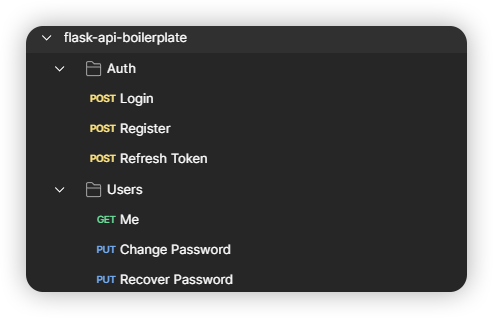

# ⚡ Flask API Boilerplate

🚀 A ready-to-go boilerplate for building a robust Flask API! This template features:

- 🔑 Provides **JWT-based authentication** with **email** and **password**.
- 🔒 Includes **Google Sign-In** using the **Authlib** library.
- 📧 Includes email functionality with templates for **account registration** and **password recovery**.
- 📦 Includes **Flask-SQLAlchemy** and **Flask-Migrate** for database persistence and migrations.

# ⚙️ Setup

1. Initialize the database and run migrations:

```bash
flask db init
flask db migrate -m "Initial migration."
flask db upgrade
```

2. Start the Flask server:

```bash
flask run
```

# 🧪 Postman Collection

A Postman collection is available in the `postman/` directory for testing the API. Here's a preview:


